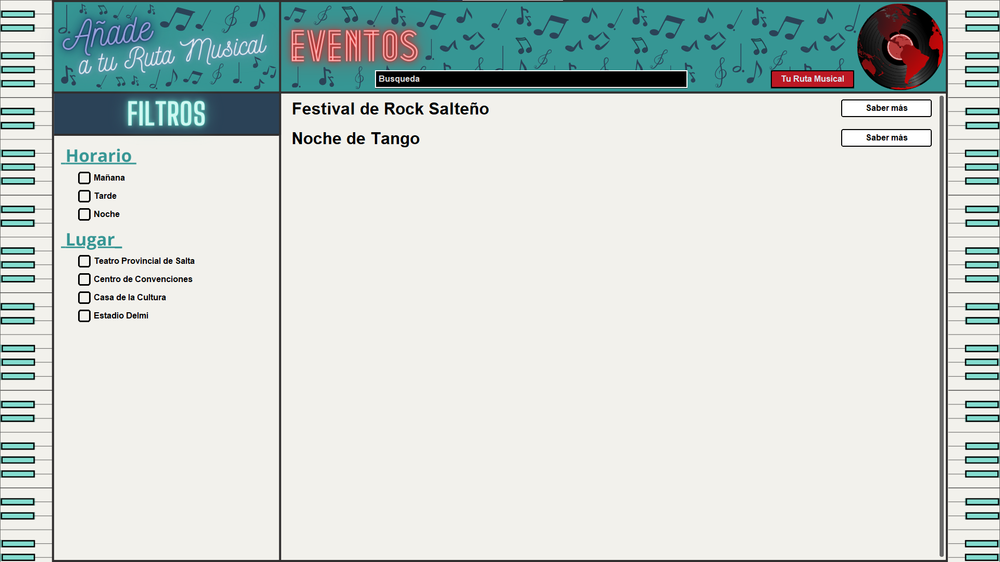
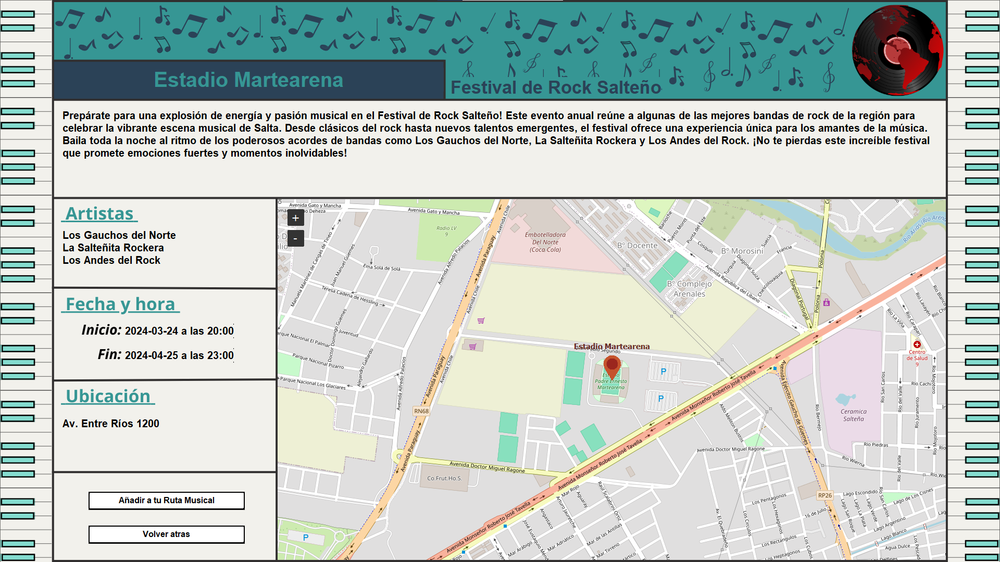
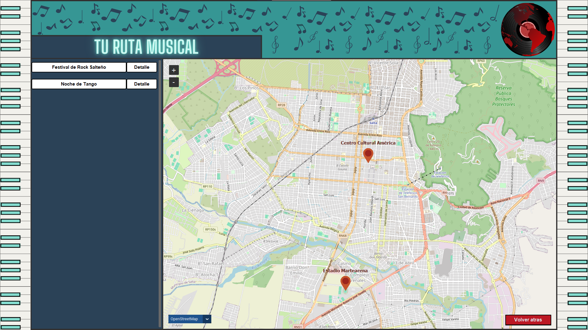
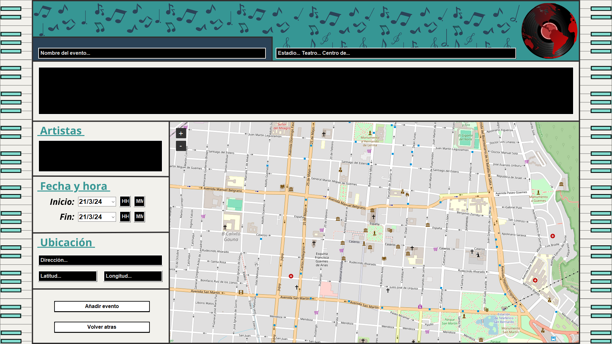

# World Tour Music 🌍🎵

Es una aplicacion de escritorio, que permite registrar eventos musicales alrededor del mundo.
Creando asi tu ruta musical.


## Screenshots 📷
### Pantalla de Inicio de Sesión

### Pantalla de Registro

### Pantalla de Menu

Si inicia sesión como admin, se añaden 2 botones: Añadir Evento / Eliminar Evento
### Pantalla de Acerca del Evento

### Pantalla de Ruta Musical

### Pantalla de Añadir Evento (Exclusivo Modo Admin)



## Instalación de Dependencias 📦

Asegúrate de tener Python 3.8.3 instalado en tu sistema antes de proceder con la instalación de las dependencias.

### Instalación de bibliotecas

Las siguientes bibliotecas son un requisito fundamental para el funcionamineto del programa, ejecute el siguiente comando en su consola:

```bash
pip install customtkinter==5.2.0 pillow==10.0.0 tkintermapview==1.29 tkcalendar==1.6.1
```
    
## Funcionalidades🛠️

- Sistema de registro y inicio de sesión.
- Uso de encriptado sha256 para el almacenamiento de las contraseñas de los usuarios.
- Modo Administrador para poder añadir eventos musicales (user = Administrador / password = 12345678).
- Sistema de visualizacion a detelle del evento, junto con un mapa que se carga por medio de internet.
- Ruta Musical unica para cada uno de los usuarios, en el cual pueden ver los eventos que añadieron y la ubicacion de los mismos en el mapa, tambien pueden ver el detalle y eliminar el evento de su Ruta Musical.
- Hacer zoom y elegir entre distintos mapas: Open Street Map - Google Map - Google Map Satelite.
